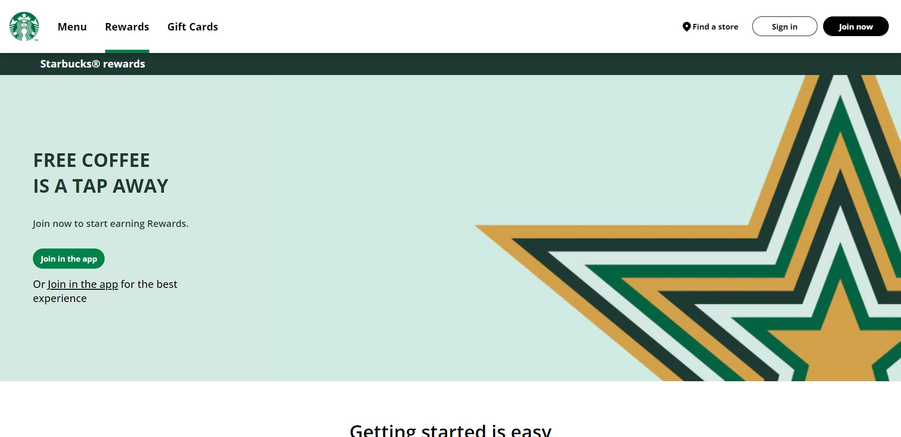
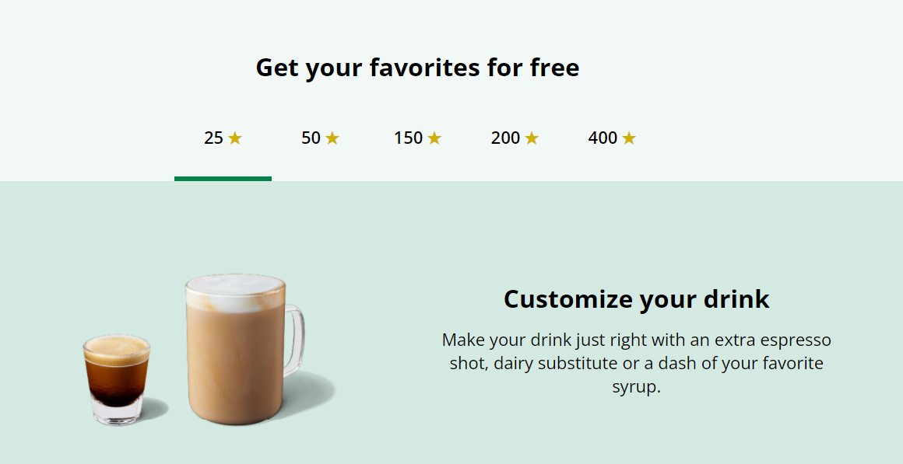
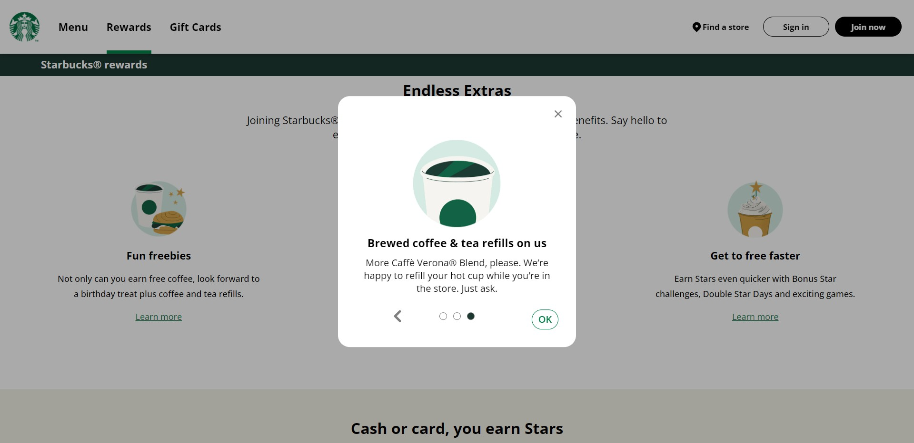
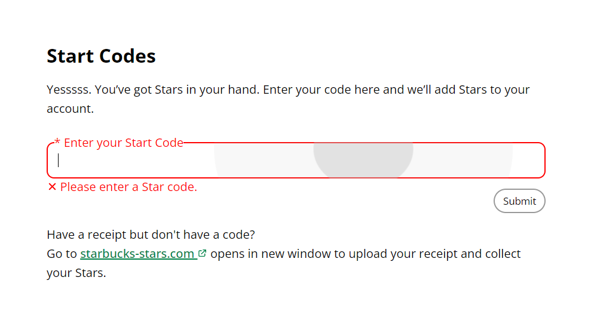
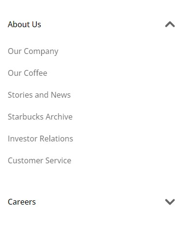

# Starbucks Rewards page clone

**[Live Demo](https://k4ung-starbucks.netlify.app/)**

### built with
- HTML5
- CSS3
- Vanilla JavaScript

I stumbled across https://frontendpractice.com the other day where I could clone some famous websites. I thought this one, out of everything would be quite painfull to clone but took me three days to finish it.

I did so many new things that I've been dying to try out using JavaScript like animated nav indicator, animated hamburger menu, dropdowns and modals. Overall, I think I got it pretty close to the orignal one.

[Actual Starbucks Rewards Page](https://www.starbucks.com/rewards)

## **Making Process**

This is my third time doing mobile-first for a project and first time using it for project this big(I only used it for small landing pages before). It took me a day and a half to implement all the JavaScript. The worst about doing this was that I had to write a ton of HTML which got tedious quickly. After everything was setup, it became so easy to transition to the desktop layout.(POWER OF MOBILE-FIRST)

## **animation**

For hamburger icon animation, I couldn't figure out a way to revert the animation so I just used 2 times more keyframes. I'd like to fix it later in the future.

## **active tab indicator**

For the animated tab indicator, I used position absolute and adjusted the width and `offsetLeft` depending on the current active tab. I also attatched it to `window.resize` event to adjust depending on the width of the screen.

## **popups**

I totally forgot about the fact that I could add the content dynamically through JavaScript and I just hard-coded all three modals. But I tried my best to reuse my same JavaScript code for all three modals.

I also didn't know much about DOM Travesal so I just used some long series of `parentElement`, `previousElementSibling`, `childNodes` and more. I should've watched a tutorial first.

## **input form**

I tried to make it as close to the actual one as possible which has this pulse effect on click and an animated placeholder and warning message. I got the placeholder working by putting the `input` tag in a div and positioning the pseudo element of that div. Same goes to the warning message.

For the pulse effect tho, I found a really good tutorial on Youtube for it. Basically, when I click somewhere on the div, it gets the coordinates of the pointer and place a new animated span element there. Then use `setTimeOut` to remove it. Pretty simple, right?

## **dropdown menus**

This dropdown menu turned out to be quite tricky. I wanted it to push everything down when shown with a nice little transition. The dropdowns I've done in the past are either `position: absolute` or staight up blocks with `display: none` or `unset`. Here I sort of combined the two by putting the actual list in a div by with `absolute` positioning and `bottom: 0`. I added `overflow: hidden` and adjusted the height of that div to get that pushing effect.

# *Try it yourself*

You could do this project yourself on [Frontend Practice](https://www.frontendpractice.com). There're tons of great websites to clone to really sharpen your frontend skills.

**And that's it! Thanks for going through my project. Happy Coding!**